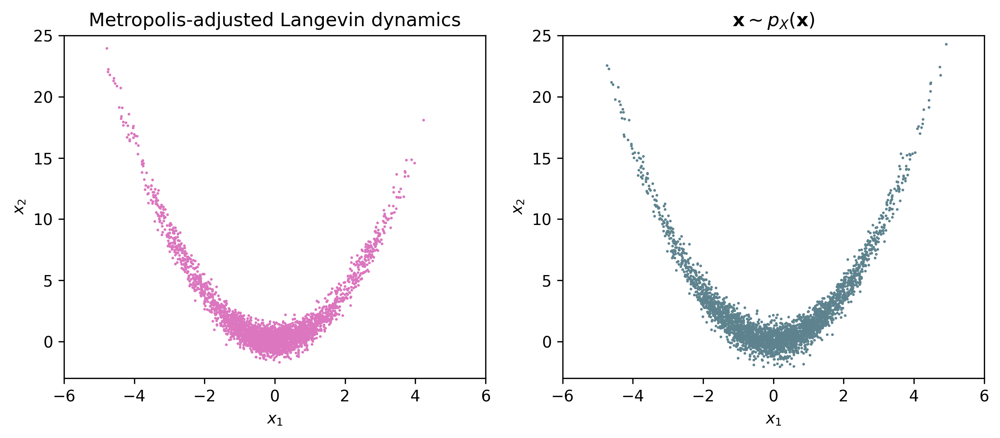

# Sampling with gradient-based Markov Chain Monte Carlo approaches

Implementation of [stochastic gradient Langevin dynamics](https://www.ics.uci.edu/~welling/publications/papers/stoclangevin_v6.pdf) (SGDL) and  [preconditioned SGLD](https://arxiv.org/pdf/1512.07666.pdf) (pSGLD), invloving simple examples of using unadjusted Langevin dynamics and [Metropolis-adjusted Langevin algorithm](https://link.springer.com/article/10.1023/A:1023562417138) (MALA) to sample from a 2D Gaussian distribution and "banana" distribution.



## Prerequisites

This code has been tested on Ubuntu 18.04 using [PyTorch-1.5.0](https://github.com/pytorch/pytorch/releases/tag/v1.5.0).

Follow the steps below to install the necessary libraries:

```bash
cd $HOME
git clone https://github.com/alisiahkoohi/Langevin-dynamics
cd Langevin-dynamics
pip install -e .
pip install --user -r  requirements.txt
```


## Script descriptions

`langevin_sampling/SGLD.py`: SGLD optimizer.

`langevin_sampling/precondSGLD.py`: pSGLD optimizer.

`langevin_sampling/samplers.py`: 

* Implements `LangevinDynamics` class that given negative-log of unnormalized density function and starting guess, runs Langevin dynamics to sample from the given density.

* Implements `MetropolisAdjustedLangevin` class that given negative-log of unnormalized density function and starting guess, runs MALA to sample from the given density.

`examples/gaussian_LD.py`: Sampling from a toy 2D Gaussian distribution with unadjusted Langevin dynamics.

`examples/gaussian_MALA.py`: Sampling from a toy 2D Gaussian distribution with MALA.

`examples/banana_LD.py`: Sampling from a toy "banana" distribution with unadjusted Langevin dynamics.

`examples/banana_MALA.py`: Sampling from a toy "banana" distribution with MALA.

### Running the code

To sample a toy 2D Gaussian distribution with unadjusted Langevin dynamics, run:

```bash
python examples/gaussian_LD.py
```

To sample a toy 2D Gaussian distribution with MALA, run:

```bash
python examples/gaussian_MALA.py
```

To sample a toy "banana" distribution with unadjusted Langevin dynamics, run:

```bash
python examples/banana_LD.py
```

To sample a toy "banana" distribution with MALA, run:

```bash
python examples/banana_MALA.py
```

## Questions

Please contact alisk@gatech.edu for further questions.


## Author

Ali Siahkoohi
